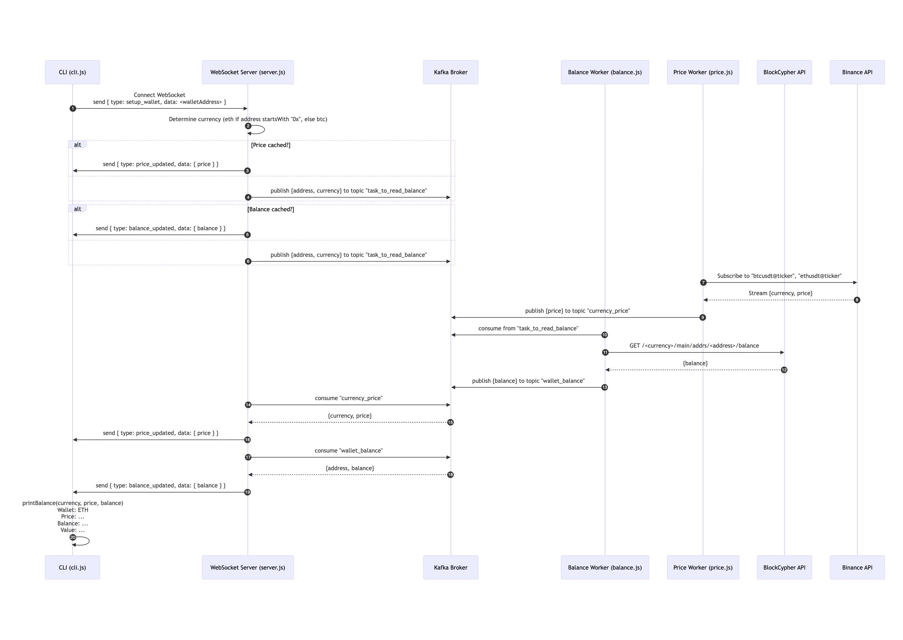

# KafkaJS Example Project

This project demonstrates a simple Node.js application using [KafkaJS](https://kafka.js.org/) to produce and consume messages with Apache Kafka. It also provides a REST API to send messages to Kafka and uses Docker Compose to set up a local Kafka environment.

## Features

- REST API endpoint to send messages to Kafka
- Kafka consumer that logs received messages
- Docker Compose setup for Kafka, Zookeeper, and Kafdrop (Kafka UI)

## Prerequisites

- [Node.js](https://nodejs.org/) (v16+ recommended)
- [Docker](https://www.docker.com/) & [Docker Compose](https://docs.docker.com/compose/)

## Getting Started

### 1. Clone the repository

```bash
git clone <your-repo-url>
cd kafkajs
```

### 2. Install dependencies

```bash
npm install
```

### 3. Start Kafka, Zookeeper, and Kafdrop

```bash
docker-compose up -d
```

- Kafka broker: `localhost:9092`
- Kafdrop UI: [http://localhost:9000](http://localhost:9000)

### 4. Start the Node.js server

```bash
npm start
```

- Server runs on [http://localhost:3000](http://localhost:3000)

## API Usage

### Send a message to Kafka

- **Endpoint:** `POST /api/send`
- **Body:** JSON `{ "message": "your-message-here" }`

Example using `curl`:

```bash
curl -X POST http://localhost:3000/api/send \
  -H "Content-Type: application/json" \
  -d '{"message": "Hello Kafka!"}'
```

## Project Structure

- `index.js` - Express server setup, Kafka consumer
- `controller.js` - API controller for sending messages
- `kafka-config.js` - KafkaJS configuration and helper methods
- `docker-compose.yml` - Docker Compose for Kafka, Zookeeper, Kafdrop

## License

ISC


